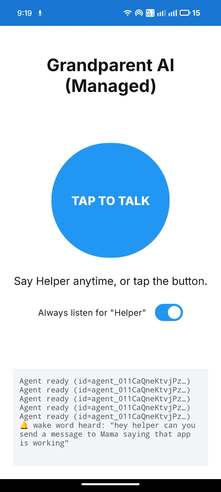

# HelpGranny

A mobile-use agent for voice-controlled assistant for elderly users that controls an Android phone on their behalf. The user speaks, and the phone acts.

<p align="center">
  
</p>


## The problem

Elderly people lose billions to scams yearly, panic during emergencies, and struggle with basic apps. Bigger fonts aren't the answer. HelpGranny doesn't teach grandma to use the phone; it uses the phone for her. She just talks. The AI taps, scrolls, types, and navigates like a grandkid sitting next to her.

## What it does

- Listens for the wake word "Helper" continuously, or responds to a tap
- Routes the request to the right specialist agent (WhatsApp, scam detection, emergency, or a direct answer)
- Sees the screen using Android's Accessibility Service, no ADB or laptop needed
- Taps, scrolls, and types on the phone using real gestures
- Speaks the result back using on-device TTS

Example commands:
- "Send a WhatsApp to my son saying I had lunch"
- "Someone is calling saying they're from the bank and need my PIN"
- "I fell, get help"
- "What time is it?" (answered directly, no screen interaction needed)

## How it works

```
User speaks
    |
    v
Wake word / TAP TO TALK
    |
    v
Orchestrator (Claude Haiku) -- routes intent
    |
    |-- DIRECT       --> speak answer
    |-- WHATSAPP     --> agent loop
    |-- SCAM_SHIELD  --> agent loop
    |-- EMERGENCY    --> agent loop
                             |
                             v
                     loop:
                       takeScreenshot() via AccessibilityService
                             |
                             v
                       Claude Sonnet 4.6 (vision)
                       --> "TAP: 540 1200" / "TYPE: hello" / "DONE: sent"
                             |
                             v
                       dispatchGesture() / ACTION_SET_TEXT
                             |
                             v
                       wait ~1s, next screenshot
                             |
                             v
                     TextToSpeech speaks final result
```

Two models are used: Haiku 4.5 for fast intent routing, Sonnet 4.6 for the vision loop that actually drives the phone.

## Repo structure

```
grandparent-ai/     Android app (Kotlin)
mobile-use/         Agent framework this is built on top of (Python, by minitap-ai)
```

The Android app is the main deliverable. `mobile-use` is included for reference as the architectural inspiration for the multi-agent orchestrator pattern used here.

## Setup

### Prerequisites

- Android Studio Hedgehog or newer
- JDK 17
- Android device running Android 11 (API 30) or higher
- An Anthropic API key from [console.anthropic.com](https://console.anthropic.com)

### Steps

1. Clone the repo and open `grandparent-ai/` in Android Studio.

2. Copy the example properties file and add your key:

```bash
cp grandparent-ai/local.properties.example grandparent-ai/local.properties
```

Edit `local.properties`:
```
ANTHROPIC_API_KEY=sk-ant-your-key-here
sdk.dir=/path/to/your/android/sdk
```

3. Build and install:

```bash
cd grandparent-ai
./gradlew installDebug
```

4. On first launch, grant microphone permission and enable the Accessibility Service when prompted. Both are required for the app to function.

## Notes

- `local.properties` is gitignored and never committed. The API key stays on your device.
- Screenshots are downscaled to 1280px before being sent to Claude to keep token cost low. Tap coordinates are scaled back up before the gesture is dispatched.
- The app only runs the agent loop during an active voice command and shows a foreground notification while it is working.
- For production use, proxy the API through your own backend so the key never ships inside the APK.

## Built with

- [Anthropic Claude API](https://docs.anthropic.com) (Haiku 4.5 + Sonnet 4.6)
- Android Accessibility Service
- [mobile-use](https://github.com/minitap-ai/mobile-use) (architecture reference)
